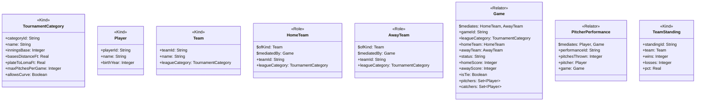
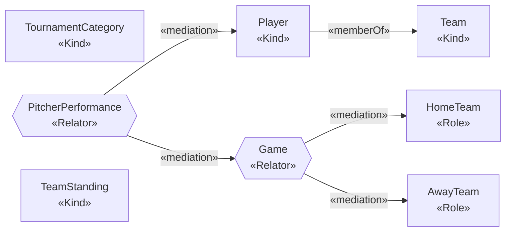

# baseball — Onto DSL diagrams

Auto-generated from the Onto DSL source.

## Type diagram

```mermaid
classDiagram
  class TournamentCategory {
    <<Kind>>
    +categoryId: String
    +name: String
    +inningsBase: Integer
    +basesDistanceFt: Real
    +plateToLomaFt: Real
    +maxPitchesPerGame: Integer
    +allowsCurve: Boolean
  }
  class Player {
    <<Kind>>
    +playerId: String
    +name: String
    +birthYear: Integer
  }
  class Team {
    <<Kind>>
    +teamId: String
    +name: String
    +leagueCategory: TournamentCategory
  }
  class HomeTeam {
    <<Role>>
    $ofKind: Team
    $mediatedBy: Game
    +teamId: String
    +leagueCategory: TournamentCategory
  }
  class AwayTeam {
    <<Role>>
    $ofKind: Team
    $mediatedBy: Game
    +teamId: String
    +leagueCategory: TournamentCategory
  }
  class Game {
    <<Relator>>
    $mediates: HomeTeam, AwayTeam
    +gameId: String
    +leagueCategory: TournamentCategory
    +homeTeam: HomeTeam
    +awayTeam: AwayTeam
    +status: String
    +homeScore: Integer
    +awayScore: Integer
    +isTie: Boolean
    +pitchers: Set~Player~
    +catchers: Set~Player~
  }
  class PitcherPerformance {
    <<Relator>>
    $mediates: Player, Game
    +performanceId: String
    +pitchesThrown: Integer
    +pitcher: Player
    +game: Game
  }
  class TeamStanding {
    <<Kind>>
    +standingId: String
    +team: Team
    +wins: Integer
    +losses: Integer
    +pct: Real
  }
```

## Relation diagram

```mermaid
flowchart LR
  TournamentCategory["TournamentCategory<br/>«Kind»"]
  Player["Player<br/>«Kind»"]
  Team["Team<br/>«Kind»"]
  HomeTeam["HomeTeam<br/>«Role»"]
  AwayTeam["AwayTeam<br/>«Role»"]
  Game{{"Game<br/>«Relator»"}}
  PitcherPerformance{{"PitcherPerformance<br/>«Relator»"}}
  TeamStanding["TeamStanding<br/>«Kind»"]
  Player -- "«memberOf»" --> Team
  Game -- "«mediation»" --> HomeTeam
  Game -- "«mediation»" --> AwayTeam
  PitcherPerformance -- "«mediation»" --> Player
  PitcherPerformance -- "«mediation»" --> Game
```
